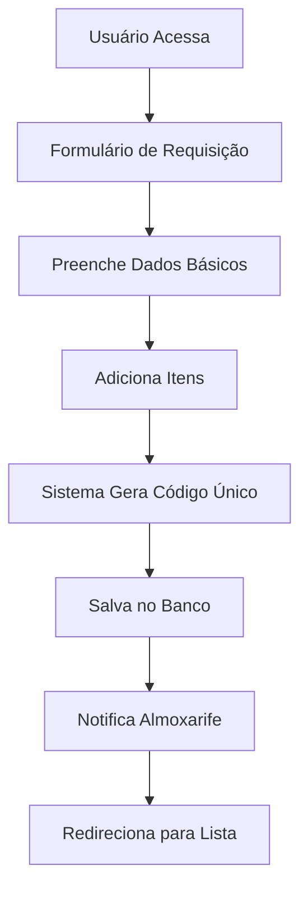
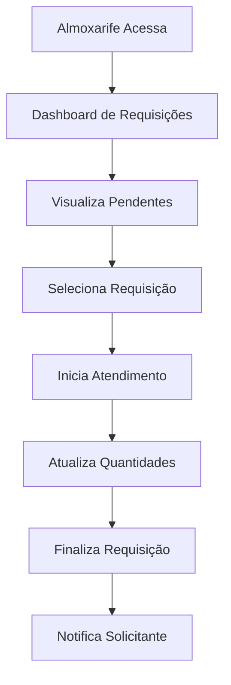
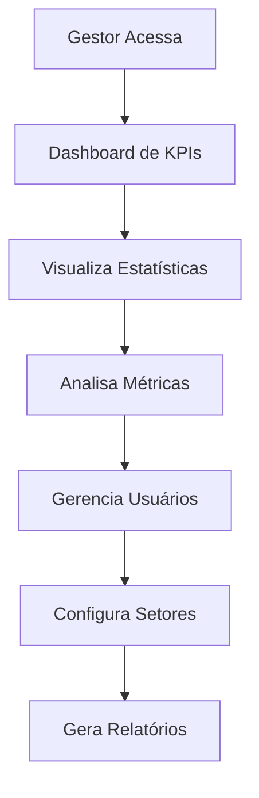

# RequisitaFácil - Sistema de Gestão de Requisições

## 📋 Visão Geral

O **RequisitaFácil** é um sistema web completo para gestão de requisições de materiais em empresas. Foi desenvolvido para automatizar e otimizar o processo de solicitação, aprovação e atendimento de materiais, proporcionando controle total sobre o fluxo de requisições e estoque.

### 🎯 Objetivo Principal
O sistema foi criado para resolver problemas comuns em gestão de materiais:
- **Controle de Requisições**: Rastreamento completo de cada solicitação
- **Fluxo de Aprovação**: Processo estruturado de aprovação e atendimento
- **Gestão de Estoque**: Controle de entrada e saída de materiais
- **KPIs e Relatórios**: Métricas para tomada de decisão
- **Multi-usuários**: Diferentes perfis com permissões específicas

---

## 🏗️ Arquitetura do Sistema

### Tecnologias Utilizadas
- **Backend**: Django 4.x (Python)
- **Frontend**: HTML, CSS, JavaScript, Bootstrap
- **Banco de Dados**: SQLite (desenvolvimento) / PostgreSQL (produção)
- **Autenticação**: Sistema próprio baseado em Django Auth
- **Templates**: Django Template Language (DTL)

### Estrutura de Pastas
```
requisitafacil-main/
├── core/                    # App principal do sistema
│   ├── models.py           # Modelos de dados (User, Request, RequestItem, etc.)
│   ├── views.py            # Lógica de negócio e controladores
│   ├── forms.py            # Formulários de entrada de dados
│   ├── urls.py             # Mapeamento de URLs
│   ├── admin.py            # Configuração do painel administrativo
│   ├── tests.py            # Testes automatizados
│   ├── migrations/         # Migrações do banco de dados
│   ├── static/core/        # Arquivos estáticos específicos
│   └── templates/core/     # Templates HTML do app
├── requisita_facil/        # Configurações do projeto Django
│   ├── settings.py         # Configurações gerais
│   ├── urls.py             # URLs principais
│   └── wsgi.py             # Configuração WSGI
├── static/                 # Arquivos estáticos globais
├── templates/              # Templates globais
├── requirements.txt        # Dependências Python
└── manage.py              # Utilitário Django
```

---

## 👥 Perfis de Usuário e Permissões

### 1. **Gestor** 🎯
**Função**: Administrador do sistema com acesso total
**Permissões**:
- Visualizar todas as requisições
- Acessar painel de KPIs e estatísticas
- Gerenciar usuários (criar, editar, excluir)
- Configurar setores
- Aprovar requisições críticas
- Gerar relatórios completos

**Acesso**: `/gestor/dashboard/`

### 2. **Almoxarife** 📦
**Função**: Responsável pelo estoque e atendimento de requisições
**Permissões**:
- Visualizar todas as requisições pendentes
- Atender requisições (aprovar/negociar)
- Substituir itens quando necessário
- Atualizar quantidades atendidas
- Marcar requisições como concluídas

**Acesso**: `/almoxarife/dashboard/`

### 3. **Encarregado** 👤
**Função**: Supervisor de setor que pode criar requisições
**Permissões**:
- Criar requisições para seu setor
- Visualizar suas próprias requisições
- Acompanhar status de suas solicitações
- Cancelar requisições pendentes

**Acesso**: `/dashboard/` (dashboard padrão)

---

## 📊 Modelos de Dados

### 1. **User** (Usuário)
```python
class User(AbstractUser):
    role = models.CharField(choices=Role.choices)  # Gestor, Encarregado, Almoxarife
    sector = models.ForeignKey(Sector)            # Setor do usuário
    email = models.EmailField(unique=True)        # Email único
```

**Propósito**: Gerencia autenticação e permissões dos usuários
**Campos Importantes**:
- `role`: Define o perfil do usuário
- `sector`: Associa o usuário a um setor específico
- `email`: Usado para login (único)

### 2. **Sector** (Setor)
```python
class Sector(models.Model):
    name = models.CharField(max_length=100, unique=True)
    created_at = models.DateTimeField(auto_now_add=True)
```

**Propósito**: Organiza usuários e requisições por setores
**Exemplos**: FLV, Frios, Padaria, Açougue, ADM, etc.

### 3. **Request** (Requisição)
```python
class Request(models.Model):
    requester = models.ForeignKey(User)           # Quem solicitou
    atendido_por = models.ForeignKey(User)       # Quem atendeu
    sector = models.ForeignKey(Sector)           # Setor da requisição
    request_code = models.CharField(unique=True) # Código único (ex: F-001)
    urgency = models.CharField(choices=Urgency.choices)  # Normal/Urgente
    status = models.CharField(choices=RequestStatus.choices)  # Pendente/Em Atendimento/Atendida
    observations = models.TextField()            # Observações gerais
```

**Propósito**: Representa uma requisição completa de materiais
**Fluxo de Status**:
1. `PENDING` → Requisição criada, aguardando atendimento
2. `EM_ATENDIMENTO` → Almoxarife iniciou o atendimento
3. `APPROVED` → Requisição finalizada

### 4. **RequestItem** (Item da Requisição)
```python
class RequestItem(models.Model):
    request = models.ForeignKey(Request)         # Requisição pai
    item_requested = models.CharField()         # Nome do item
    quantify = models.PositiveIntegerField()    # Quantidade solicitada
    category = models.CharField(choices=ItemCategory.choices)  # Categoria
    quantidade_atendida = models.PositiveIntegerField(default=0)  # Qtd. atendida
    observacao_item = models.CharField()        # Observações do item
```

**Propósito**: Representa cada item individual dentro de uma requisição
**Categorias Disponíveis**:
- Insumo(Produção)
- Embalagens
- Limpeza
- Area de venda
- Administrativo

---

## 🔄 Fluxos Principais do Sistema

### 1. **Fluxo de Criação de Requisição**



**Detalhamento**:
1. **Acesso**: Usuário acessa `/requisicoes/criar/`
2. **Formulário**: Preenche urgência e observações
3. **Itens**: Adiciona múltiplos itens com quantidades
4. **Código**: Sistema gera código único (ex: F-001, PD-002)
5. **Salvamento**: Requisição é salva com status "PENDENTE"
6. **Notificação**: Sistema notifica almoxarife (se configurado)
7. **Redirecionamento**: Usuário é levado para lista de requisições

### 2. **Fluxo de Atendimento (Almoxarife)**



**Detalhamento**:
1. **Dashboard**: Almoxarife acessa `/almoxarife/dashboard/`
2. **Listagem**: Vê todas as requisições pendentes
3. **Seleção**: Escolhe uma requisição para atender
4. **Início**: Clica em "Iniciar Atendimento"
5. **Atualização**: Preenche quantidades atendidas
6. **Finalização**: Marca como "ATENDIDA"
7. **Notificação**: Sistema notifica o solicitante

### 3. **Fluxo de Gestão (Gestor)**



**Detalhamento**:
1. **Dashboard**: Gestor acessa `/gestor/dashboard/`
2. **KPIs**: Visualiza métricas em tempo real
3. **Usuários**: Gerencia perfis e permissões
4. **Configurações**: Ajusta setores e parâmetros
5. **Relatórios**: Exporta dados para análise

---

## 🎛️ Funcionalidades Detalhadas

### 1. **Sistema de Códigos Únicos**

**Como Funciona**:
- Cada requisição recebe um código único automaticamente
- Formato: `{ABREVIAÇÃO_SETOR}-{NÚMERO_SEQUENCIAL}`
- Exemplos: F-001 (FLV), PD-002 (Padaria), AC-003 (Açougue)

**Implementação**:
```python
def save(self, *args, **kwargs):
    if not self.request_code and self.sector:
        abreviacao = setor_abreviacoes.get(self.sector.name, "GEN")
        last_request = Request.objects.filter(
            request_code__startswith=abreviacao
        ).order_by('-created_at').first()
        next_number = 1
        if last_request and last_request.request_code:
            last_number = int(last_request.request_code.split('-')[-1])
            next_number = last_number + 1
        self.request_code = f'{abreviacao}-{next_number}'
    super().save(*args, **kwargs)
```

### 2. **Sistema de Permissões**

**Implementação**:
```python
def is_almoxarife(user):
    return user.is_authenticated and user.role == Role.Almoxarife

def is_gestor(user):
    return user.is_authenticated and user.role == Role.Gestor

@user_passes_test(is_almoxarife)
def almoxarife_dashboard(request):
    # Apenas almoxarifes podem acessar
```

**Uso**: Decoradores `@user_passes_test()` controlam acesso às views

### 3. **Sistema de KPIs**

**Métricas Calculadas**:
- Requisições pendentes
- Requisições em atendimento
- Requisições atendidas hoje
- Tempo médio de atendimento
- Requisições urgentes

**Implementação**:
```python
# Estatísticas do painel
pendentes = Request.objects.filter(status=RequestStatus.PENDING).count()
em_atendimento = Request.objects.filter(status=RequestStatus.EM_ATENDIMENTO).count()
aprovadas_hoje = Request.objects.filter(
    status=RequestStatus.APPROVED, 
    updated_at__date=today
).count()
```

### 4. **Sistema de Alertas**

**Tipos de Alerta**:
- Requisições urgentes pendentes (>3)
- Requisições com tempo de espera alto
- Setores sem almoxarife designado

**Implementação**:
```python
alertas = []
urgentes_pendentes = Request.objects.filter(
    status=RequestStatus.PENDING, 
    urgency='URGENTE'
).count()
if urgentes_pendentes > 3:
    alertas.append({
        'tipo': 'danger',
        'titulo': 'Requisições urgentes pendentes!',
        'descricao': f'Há {urgentes_pendentes} requisições urgentes aguardando.',
    })
```

---

## 🛠️ Manutenção e Desenvolvimento

### 1. **Adicionando Novos Setores**

**Passo a Passo**:
1. Acesse o admin Django: `/admin/`
2. Vá em "Setores" → "Adicionar Setor"
3. Digite o nome do setor
4. Adicione a abreviação no código (se necessário)

**Código** (em `core/models.py`):
```python
setor_abreviacoes = {
    "FLV": "F",
    "Frios": "FR",
    "Padaria": "PD",
    "Açougue": "AC",
    "ADM": "ADM",
    "Deposito": "DP",
    "Limpeza": "LP",
    "Comercial": "CM",
    "Loja": "LJ",
    "NOVO_SETOR": "NS",  # Adicione aqui
}
```

### 2. **Criando Novos Perfis de Usuário**

**Passo a Passo**:
1. Adicione a nova role em `core/models.py`:
```python
class Role(models.TextChoices):
    Gestor = 'Gestor', 'Gestor'
    Encarregado = 'Encarregado', 'Encarregado'
    Almoxarife = 'Almoxarife', 'Almoxarife'
    NovoPerfil = 'NovoPerfil', 'Novo Perfil'  # Adicione aqui
```

2. Crie a função de verificação:
```python
def is_novo_perfil(user):
    return user.is_authenticated and user.role == Role.NovoPerfil
```

3. Aplique o decorador nas views:
```python
@user_passes_test(is_novo_perfil)
def nova_view(request):
    # Lógica específica do novo perfil
```

### 3. **Adicionando Novos Status de Requisição**

**Passo a Passo**:
1. Adicione o novo status em `core/models.py`:
```python
class RequestStatus(models.TextChoices):
    PENDING = 'PENDING', 'Pendente'
    EM_ATENDIMENTO = 'EM_ATENDIMENTO', 'Em Atendimento'
    APPROVED = 'APPROVED', 'Atendida'
    NOVO_STATUS = 'NOVO_STATUS', 'Novo Status'  # Adicione aqui
```

2. Atualize as views que usam status
3. Execute migração: `python manage.py makemigrations && python manage.py migrate`

### 4. **Criando Novos Relatórios**

**Exemplo de Relatório**:
```python
def relatorio_setores(request):
    # Agrupa requisições por setor
    relatorio = Request.objects.values('sector__name').annotate(
        total=Count('id'),
        pendentes=Count('id', filter=Q(status=RequestStatus.PENDING)),
        atendidas=Count('id', filter=Q(status=RequestStatus.APPROVED))
    )
    
    context = {'relatorio': relatorio}
    return render(request, 'core/relatorio_setores.html', context)
```

### 5. **Adicionando Novos Campos**

**Exemplo - Adicionar campo "Prioridade"**:
1. Modifique o modelo em `core/models.py`:
```python
class Request(models.Model):
    # ... campos existentes ...
    prioridade = models.CharField(
        max_length=20,
        choices=[
            ('BAIXA', 'Baixa'),
            ('MEDIA', 'Média'),
            ('ALTA', 'Alta'),
        ],
        default='MEDIA',
        verbose_name="Prioridade"
    )
```

2. Atualize o formulário em `core/forms.py`:
```python
class RequestForm(forms.ModelForm):
    class Meta:
        model = Request
        fields = ['urgency', 'observations', 'prioridade']  # Adicione o novo campo
```

3. Execute as migrações:
```bash
python manage.py makemigrations
python manage.py migrate
```

---

## 🧪 Testes e Qualidade

### 1. **Estrutura de Testes**

**Arquivos de Teste**:
- `core/tests.py`: Testes integrados e de unidade
- `core/test_funcionalidades.py`: Testes unitários independentes
- `executar_testes_funcionalidades.py`: Script interativo para testes

### 2. **Executando Testes**

**Comando Básico**:
```bash
python manage.py test core
```

**Script Interativo**:
```bash
python executar_testes_funcionalidades.py
```

**Opções do Menu**:
1. Testar criação de requisições
2. Testar sistema de permissões
3. Testar KPIs do gestor
4. Testar fluxo completo
5. Testar requisições urgentes
6. Testar estatísticas
7. Testar códigos únicos
8. Testar stress (múltiplas requisições)
9. Rodar todos os testes
10. Limpar banco de dados

### 3. **Criando Novos Testes**

**Exemplo de Teste**:
```python
def test_nova_funcionalidade(self):
    """Testa uma nova funcionalidade do sistema"""
    # Arrange
    user = User.objects.create_user(
        username='testuser',
        email='test@example.com',
        role=Role.Encarregado
    )
    
    # Act
    # Execute a funcionalidade
    
    # Assert
    # Verifique o resultado esperado
```

---

## 🚀 Instalação e Configuração

### 1. **Requisitos do Sistema**
- Python 3.8 ou superior
- pip (gerenciador de pacotes Python)
- Git (para clonar o repositório)

### 2. **Instalação Passo a Passo**

```bash
# 1. Clone o repositório
git clone <url-do-repositorio>
cd requisitafacil-main

# 2. Crie ambiente virtual
python -m venv venv

# 3. Ative o ambiente virtual
# Windows:
venv\Scripts\activate
# Linux/macOS:
source venv/bin/activate

# 4. Instale dependências
pip install -r requirements.txt

# 5. Instale dependências para tempo real (opcional)
pip install uvicorn fastapi

# 6. Configure variáveis de ambiente (opcional)
# Crie um arquivo .env com suas configurações

# 7. Execute migrações
python manage.py migrate

# 8. Crie superusuário
python manage.py createsuperuser

# 9. Execute os servidores
python start_servers.py
```

### 3. **Configuração de Produção**

**Settings de Produção** (`requisita_facil/settings.py`):
```python
DEBUG = False
ALLOWED_HOSTS = ['seudominio.com', 'www.seudominio.com']

# Banco de dados PostgreSQL
DATABASES = {
    'default': {
        'ENGINE': 'django.db.backends.postgresql',
        'NAME': 'requisitafacil_db',
        'USER': 'seu_usuario',
        'PASSWORD': 'sua_senha',
        'HOST': 'localhost',
        'PORT': '5432',
    }
}

# Configurações de segurança
SECURE_SSL_REDIRECT = True
SESSION_COOKIE_SECURE = True
CSRF_COOKIE_SECURE = True
```

### 4. **Sistema de Atualizações em Tempo Real**

O sistema possui um servidor FastAPI separado para atualizações em tempo real via WebSocket.

**Iniciar ambos os servidores:**
```bash
# Opção 1: Script automático (recomendado)
python start_servers.py

# Opção 2: Manualmente
# Terminal 1 - Django:
python manage.py runserver 8000

# Terminal 2 - FastAPI:
python -m uvicorn realtime_server:app --host 0.0.0.0 --port 8001 --reload
```

**Testar comunicação:**
```bash
python test_realtime.py
```

**Como funciona:**
1. Django envia notificações para FastAPI quando requisições são criadas/atualizadas
2. FastAPI distribui as notificações via WebSocket para todos os clientes conectados
3. Frontend recebe as notificações e atualiza automaticamente a lista de requisições

### 5. **Configuração de Email**

**Para notificações** (`settings.py`):
```python
EMAIL_BACKEND = 'django.core.mail.backends.smtp.EmailBackend'
EMAIL_HOST = 'smtp.gmail.com'
EMAIL_PORT = 587
EMAIL_USE_TLS = True
EMAIL_HOST_USER = 'seu_email@gmail.com'
EMAIL_HOST_PASSWORD = 'sua_senha_app'
```

---

## 📈 Monitoramento e Logs

### 1. **Logs do Sistema**

**Configuração de Logs** (`settings.py`):
```python
LOGGING = {
    'version': 1,
    'disable_existing_loggers': False,
    'handlers': {
        'file': {
            'level': 'INFO',
            'class': 'logging.FileHandler',
            'filename': 'requisitafacil.log',
        },
    },
    'loggers': {
        'django': {
            'handlers': ['file'],
            'level': 'INFO',
            'propagate': True,
        },
    },
}
```

### 2. **Métricas Importantes**

**KPIs para Monitorar**:
- Tempo médio de atendimento
- Taxa de requisições urgentes
- Satisfação dos usuários
- Volume de requisições por setor
- Performance do sistema

---

## 🔧 Solução de Problemas

### 1. **Problemas Comuns**

**Erro: "No module named 'django'"**
```bash
# Solução: Ative o ambiente virtual
venv\Scripts\activate  # Windows
source venv/bin/activate  # Linux/macOS
```

**Erro: "Database is locked"**
```bash
# Solução: Reinicie o servidor
python manage.py runserver
```

**Erro: "Permission denied"**
```bash
# Solução: Verifique permissões de arquivo
chmod +x manage.py  # Linux/macOS
```

### 2. **Debug e Desenvolvimento**

**Modo Debug**:
```python
DEBUG = True  # Em settings.py
```

**Logs Detalhados**:
```python
LOGGING = {
    'version': 1,
    'disable_existing_loggers': False,
    'handlers': {
        'console': {
            'class': 'logging.StreamHandler',
        },
    },
    'loggers': {
        'django': {
            'handlers': ['console'],
            'level': 'DEBUG',
        },
    },
}
```

---

## 📞 Suporte e Contato

### **Canais de Suporte**
- **E-mail**: suporte@requisitafacil.com
- **GitHub Issues**: [Abrir issue](https://github.com/seuusuario/requisitafacil/issues)
- **Documentação**: Este README e arquivos de documentação

### **Informações do Projeto**
- **Versão**: 1.0.0
- **Última Atualização**: Dezembro 2024
- **Licença**: MIT
- **Desenvolvedor**: Equipe RequisitaFácil

---

## 📝 Changelog

### Versão 1.2.5 (Julho de 2025)
- ✅ Sistema básico de requisições
- ✅ Perfis de usuário (Gestor, Almoxarife, Encarregado)
- ✅ Dashboard com KPIs
- ✅ Sistema de códigos únicos
- ✅ Testes automatizados
- ✅ Documentação completa

---

© 2024 RequisitaFácil. Todos os direitos reservados. 